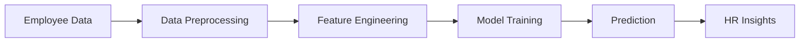

# 👩‍💼 Employee Performance Predictor

### 🚀 Machine Learning | HR Analytics | Streamlit App

<p align="center">
  
  
  
  
  
</p>

---

## 📌 Project Overview

This project is an **end-to-end Machine Learning system** that predicts employee performance levels (**Low, Medium, High**) using HR-related data such as experience, salary, training hours, and projects.

It simulates a real-world HR analytics environment and demonstrates how organizations can make **data-driven decisions**.

---

## 🎯 Problem Statement

Organizations often struggle with:

* Identifying high-performing employees
* Detecting underperformance early
* Making promotion decisions

👉 This project solves these challenges using **Machine Learning predictions**

---

## 💡 Key Features

✨ Synthetic HR dataset generation
✨ Data preprocessing & encoding
✨ Random Forest classification model
✨ Model evaluation (Accuracy, Confusion Matrix)
✨ Feature importance visualization
✨ Interactive **Streamlit Web App**

---

## 🛠️ Tech Stack

| Category      | Tools               |
| ------------- | ------------------- |
| Language      | Python              |
| Libraries     | Pandas, NumPy       |
| ML Model      | Random Forest       |
| Visualization | Matplotlib, Seaborn |
| Deployment    | Streamlit           |

---

## 🏗️ Project Architecture



---

## 🌐 Live Demo

🚀 **Try the App Here:**
👉 https://employee-performance-predictor-lvpgccdeaj3ptonhwt9cfe.streamlit.app/

---


---

## 📊 Model Performance

* Accuracy: **~65%**
* Realistic classification results
* Balanced performance prediction

---

## 📸 Screenshots

### 🔹 App Interface

### 🔹 Prediction Result

### 🔹 Feature Importance

---

## ▶️ How to Run (One Flow)

### 1️⃣ Clone Repository

```bash
git clone https://github.com/sinchana4778/Employee-Performance-Predictor-ML.git
cd Employee-Performance-Predictor-ML
```

### 2️⃣ Install Dependencies

```bash
pip install -r requirements.txt
```

### 3️⃣ Run ML Model

```bash
python main.py
```

### 4️⃣ Launch Web App

```bash
streamlit run app.py
```

---

## 🧠 How It Works (Simple Flow)

1. Generate synthetic employee dataset
2. Preprocess and encode data
3. Train Random Forest model
4. Predict employee performance
5. Display results in Streamlit app

---

## 🔮 Future Improvements

🚀 Use real HR datasets
🚀 Add deep learning models
🚀 Build advanced dashboards
🚀 Deploy full-stack system

---

## 👨‍💻 Author

**Sinchana B A**

---

## ⭐ Support

If you like this project:

👉 Star ⭐ this repository
👉 Share feedback

--